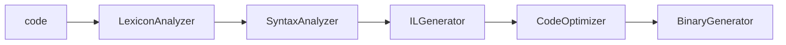

# Dotnet
## Environment


## Estrutura de projeto
* Um Solution(.sln) pode guardar varios projetos csharp(.csproj) oque permite um projeto interagir e usar classes de outros projetos, e.g projetos auxiliares
* e.g:
.snl -> auxiliar.csproj 
			|		|
	proj1.csproj  proj2.csproj
	

## Compilers
* Compilador: Converte linguagem de alto nivel para baixo nivel, e.g C# -> Binary
* Transpilador: converte linguagem de alto nivel para alto nivel, e.g typescript -> javascript



* Para criar um nova solucao:
```shell
dotnet new sln -n "NOMEDASOLUCAO"
```

* Para adicionar um projeto existente a uma solucao:
```shell
cd "PATH_TO_PROJECT_ROOT"
dotnet sln "PATH_TO_SLN" add "PATH_TO_CSPROJ"
```

* Para Permitir um Projeto Reconhecer outro:
```shell
dotnet add "PATH_TO_TARGET_CSPROJ" reference "PATH_TO_REFERENCED_CSPROJ"
```

* Para Criar um novo projeto (console)
```shell
dotnet new console
```
	
* Para criar um projeto em uma versao especifica:
```shell
dotnet new console --framework net5.0
```

* Para Compilar um projeto
```shell
dotnet build
```

* Para Rodar e Compilar Um projeto:
```shell
dotnet run
```

* Compilador Dotnet:
```mermaid
flowchart LR;
c#Code --> C#Compiler --> IL_AKA_IntermediaryLanguage Code_.exe_AND.dll --> JITCompiler_AKA_JustInTime --> NativeCode_AKA_Binary
```

* verificar .net no cmd: "dotnet --info"

## C# 
* Exemple:
```csharp
using System;
using System.Collections.Generic;
using System.Linq;
using System.Threading.Tasks;

namespace ProjectName.FolderName {
	public class ClassName {
		public string Property {get; set;}
		public void Method(int argument){}
	}
}
```

* Exemple Program(driver file) .Net6+:
```csharp
Console.writeLine("Hello World");
```

* Exemple Program(Driver file) .Net5 and lower:
```csharp
using System;

namespace NAMESCAPE.NAME {
	class Program {
		static void Main(string[] args) {
			Console.writeLine("Hello world");
		}
	}
}
```

### Sintaxe e Convencoes
* Nomeclaturas:
	- Metodos/Funcoes sao escritas Capitalizadas em PascalCame
	- Classes sao escritas Capitalizadas em PascalCase
	- Nome do arquivo da classe e da classe devem ser iguais
	- Propriedades/Atributos sao escritos Capitalizados em PascalCase
	- Variaveis sao escritos em camelCase
	- abreviacoes sao contra as convencoes do C#

* Cases:
	- camelCase
	- PascalCase
	- snake_case
	- spinal-case

### Comentarios
* Unica Linha: //Comentary
* Multipla Linha: /*Comentary*/
* Documentar  Classes, Metodos, etc.: <summary>
* e.g summary on class
```csharp
///<summary>
///
///</summary>
class ClassName {}
```

* e.g summary on method:
```csharp
///<summary>
///
///</summary>
///<param name="x">comentary about param </param>
///<returns>commentary about return</returns>
public int MethodName(int x){
	Console.WriteLine(x);
	return x - 1;
}
```

### Propriedades/Variaveis
* criando uma variavel (Scopo Global)
```csharp
string PropertyName = "Value";
```

* criando uma propriedade (Scopo de Classe)
```csharp
public string PropertyName{get; set;}
```

### Datatype
* string: char array, a.k.a cadeia de character. e.g "textos", 'textos'
* char: unicode character, e.g 'a'
* bool: boolean, e.g true, false				|false
* byte: 8-bit unsigned int, e.g 0 to 255
* decimal: melhor para valores monetarios		|0.0M
* float: 32-bit single-precision float point	|0.0f
* double: 64-bit double-presicio float point 	|0.0D
* short: 16-bit signed int
* int: 32-bit signed int 
* long: 64-bit signed int 
* uint: 32-bit unsigned int 
* ulong: 64-bit unsigned int 
* DateTime: struct com data vimdo do sistema


#### Casting / Conversao de Tipo
* Convert:
```csharp
int a = Convert.ToInt32("5");
```
*NT.: convert: automaticamente converte null para 0, ao contrario do Parse

* Parse:
```csharp
int b = int.Parse("5");
```

* cast de string:
```csharp
int numero = 5;
string a = numero.ToString();
```

* cast implicito:
```csharp
int a = 5;
double b = 5;
```
*NT.: <int> a esta sendo convertido para <double> a

* Cast com tratamento de erro
```csharp
string a = "15c";
int b = 0;
int.TryParse(a, out b);
```
*NT.: mesmo que a conversao de erro, o TryParse ira retornar o segundo valor expecificado e continua o programa

### Operadores
#### Ordem dos Operadores
1. ()
2. *, /
3. +, -

#### Operadores de Atribuicao
* '=' 	: atribui um valor a uma variavel
* '+=' 	: soma e atribui um valor a uma variavel, i.e a = a + b
* '-=' 	: subtrai e atribui um valor a uma variavel, i.e a = a - b
* '/=' 	: divide e atribui um valor a uma variavel, i.e a = a / b 
* '*='	: multiplica e atribui um valor a uma variavel, i.e a = a * b
* 'a++' : adiciona 1 a variavel, i.e a = a + 1
* 'a--' : subtrai 1 a variavel, i.e a = a - 1

#### Operadores Logicos
* '&&' 	: AND, E, e.g true && true 
* '||'	: OR, OU, e.g true || false
* '=='	: iqual a 
* '!'	: NOT, nao e.g !choveu
* '>='	: maior que 
* '<='	: menor que 

#### Operadores Condicionais / Flow Control
* If...Else:
```csharp
if (CONDITION) {
	TRUE_BLOCK;

} else if (CONDITION) {
	TRUE_BLOCK;
	
} else {
	FALSE_BLOCK;
}
```

* Switch Case:
```csharp
switch (CONDITION) {
	case CONDITION:
		TRUE_BLOCK;
		break;
	
	default:
		FALSE_BLOCK;
		break;
}
```

#### Operadores aritimeticos
* Adicao: '+', e.g x + y
* Subtracao: '-', e.g x - y
* Multiplicacal: '*', e.g x * y
* Divisao: '/' e.g x / y
* Modulo: '%', i.e resto de divisao, e.g x % y
* Potencia: 'Math.Pow()', e.g Math.Pow(x, y)
* Seno, Coseno, Tangente: Math.Sin(x), Math.Cos(x), Math.Tan(x)
* Raiz Quadrada: Math.sqrt(x);

### Estruturas de Repeticao / Loops
* For:
```csharp
for (int i = 0; i <= 10; i++) {
	CODE_BLOCK
}
```

* While:
```csharp
int i = 0;
while (i <= 10) {
	CODE_BLOCK
	i++;
}
```
*NT.: Pode ser interonpido com 'break;'

* Do While:
```csharp
do {
	CODE_BREAK
	i++;
} while (i <= 9);
```
*NT.: Pode ser Iterronpido com 'break;'

### Arrays
* Criando um Array com um tamanho de 4:
```csharp
int[] array = new int[4];
```

* Criando um array de tamanho 4, passando valores:
```csharp
int[] array = new int[] {42, 71, 22, 30};
```

* acessando item no array:
```csharp
array[0] = 42;
```

* acessando array usando for:
```csharp
for(int i = 0; i < array.Length; i++) {
	CODE_BLOCK;
}
```

* Copiando os elementos de um array para outro:
```csharp
int[] array2 = new int[8];
Array.Copy(array, array2, 4);
```
* i.e (array, arrayTarget, indexTarget), ira copiar de um array para outro do index 0 ate o indexTarget

* acessando array usando foreach:
```csharp
foreach(int valor in array) {
	CODE_BLOCK;
}
```

* aumentar tamanho do array:
```csharp
Array.Resize(ref array, 8);
```

### Listas / Lists
* Vantagem de Uma Lista:
	1. Gerencia Tamanho automaticamente.
	
* Declarando uma Lista:
```csharp
List<int> lista1 = new List<int>();
```

* Adicionando Elementos a uma lista:
```csharp
lista1.Add(12);
lista1.Add(20);
```

* Removendo Elementos de uma Lista:
```csharp
lista1.Remove(12);
```

* Acessando Lista usando for:
```csharp
for(int i = 0; i < lista1.Count;i++){
	CODE_BLOCK;
}
```

* Acessando Lista usando foreach:
```csharp
foreach(int item in lista1) {
	CODE_BLOCK;
}
```

### Funcoes/Metodos
```csharp
public void MethodName(){}
```

* Output:
```csharp
Console.writeLine($"Hi, i'm {variable}");
```

* Input:
```csharp
Console.ReadLine();
```

* Console:
```csharp
Console.Clear();
```

* Encerrar Programa:
```csharp
Environment.Exit(0);
```

### Classes
* Exemplo:
```csharp
public class ClassName {
	public string Property {get; set;}
	public void Methods() {}
}
```

* Instanciando uma Classe:
```csharp
Using NamespaceName;
ClassName classInstanceName = new ClassName();
```

* Validacao de Propriedades
```csharp
public class Pessoa {
	private string _nome;
	
	public string Nome {
		get => _nome.ToUpper(); //A maneira resumida e recomendade de retornar uma simples linha
		
		set {
			if (value == "") {
				throw new ArgumentException("o valor nao pode ser vazil");
			}
		}
	}
	
}
```

* Construtores
```csharp
public class Pessoa {
	public Pessoa() {
		//Padrao, permite nao ter input ao instanciar a classe
	}
	
	public Pessoa(string property) {
		//Obriga passa parametro ao instaciar a class, pode ter mais de um construtor
		Property = property;
	}

	public string Property {get; set;}
	public string Method(){}
}

Pessoa pessoaInstancia01 = new Pessoa("Nome");
Pessoa pessoaInstancia02 = new Pessoa();
```