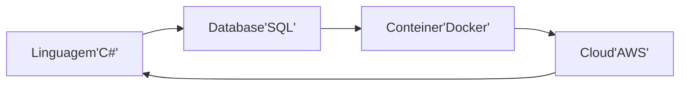
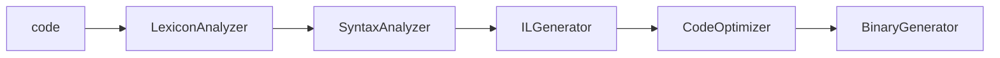

# Dotnet
## Environment

## Compilers
* Compilador: Converte linguagem de alto nivel para baixo nivel, e.g C# -> Binary
* Transpilador: converte linguagem de alto nivel para alto nivel, e.g typescript -> javascript




## .netcompiler
c# Code -> C# Compiler -> IL(Intermediary Language) Code (*.exe, *.dll) -> JIT (Just in Time) Compiler -> Native Code (Binary)

* verificar .net no cmd: "dotnet --info"

## C# 
* Exemple:
```
using System;
using System.Collections.Generic;
using System.Linq;
using System.Threading.Tasks;

namespace ProjectName.FolderName {
	public class ClassName {
		public string propertyName {get; set;}
		public void Method(){}
	}
}
```

> $dotnet new console
	- cria um projeto(console)
	
> $dotnet build
	- compila um projeto

> $dotnet run
	- compila e roda projeto
### Sintaxe e Convencoes
* Nomeclaturas:
	- Metodos/Funcoes sao escritas Capitalizadas em PascalCame
	- Classes sao escritas Capitalizadas em PascalCase
	- Nome do arquivo da classe e da classe devem ser iguais
	- Propriedades/Atributos sao escritos Capitalizados em PascalCase
	- Variaveis sao escritos em camelCase
	- abreviacoes sao contra as convencoes do C#

* Cases:
	- camelCase
	- PascalCase
	- snake_case
	- spinal-case

### Propriedades/Variaveis
> $public string PropertyName{get; set;}
> $PropertyName = "Value";

### Datatype
* string: char array, a.k.a cadeia de character. e.g "textos", 'textos'
* char: unicode character, e.g 'a'
* bool: boolean, e.g true, false, 0, 1			|false
* byte: 8-bit unsigned int, e.g 0 to 255
* decimal: melhor para valores monetarios		|0.0M
* float: 32-bit single-precision float point	|0.0f
* double: 64-bit double-presicio float point 	|0.0D
* short: 16-bit signed int
* int: 32-bit signed int 
* long: 64-bit signed int 
* uint: 32-bit unsigned int 
* ulong: 64-bit unsigned int 
* DateTime: struct com data vimdo do sistema

### Classes
```
public class ClassName {
	public string Property {get; set;}
	public void Methods() {}
}
```
* Instanciando uma Classe:
> Using NameSpace;
> $ClassName classInstance = new ClassName();

* Atibutos primeiro, depois metodos

### Funcoes/Metodos
```
> $public void MethodName(){}
```

* Output
> $Console.writeLine($"Hi, i'm {variable}");